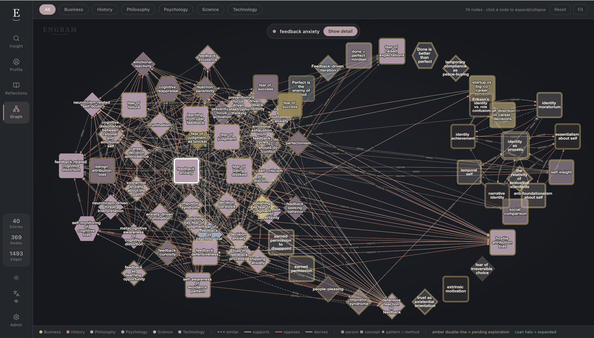
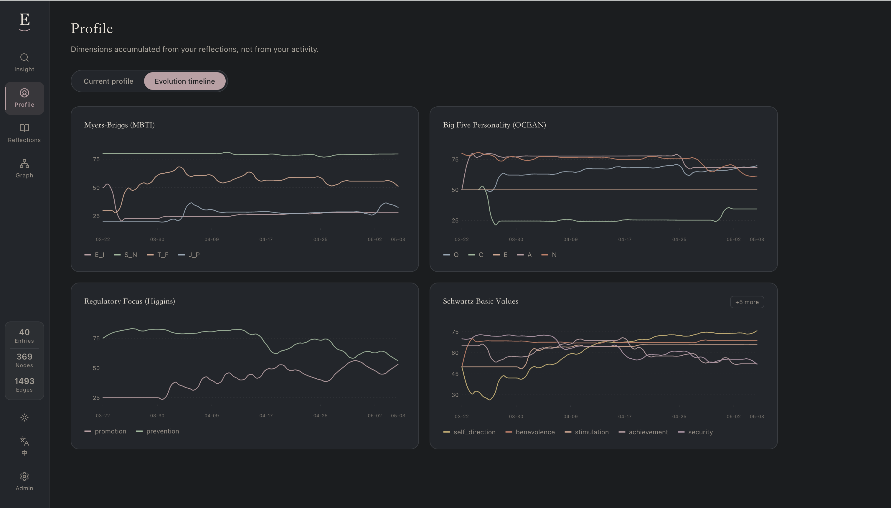

# Engram

**English** · [中文](README.zh.md)

> **Engram — the part of you that your AI has been missing.**

Most AI tools answer your question. Engram answers *you*.

It quietly builds a model of how you think — your values, fears, recurring patterns, the contradictions you can't see from the inside. Then any AI you connect (Claude, Cursor, Codex…) stops being a smart stranger and starts being something closer to a coach who has known you for years.

Not a notes app. Not a memory layer. A **personal cognitive mirror** — built to surface the blind spots that hold you back, and the breakthroughs you didn't know were already in you.

---

## A glimpse of what that feels like

Same model under the hood — two different lenses, personal and professional.

### Personal

> **You:** I keep saying yes when I want to say no — then I resent it. Why?
>
> **Engram:** This isn't a willpower problem. Three forces in your map are pulling at the same time:
>
> - Approval-seeking pattern (**strength 0.86**, your second-strongest node) — you read disapproval as danger before the sentence is even finished.
> - High **agreeableness (78)** + low **assertiveness (32)** — your default reflex is "smooth it over," not "hold the line."
> - Schwartz **conformity** ranks above **self-direction** — you genuinely value harmony, but the bill comes out of your own time.
>
> The antidote is already in your records: three weeks ago you wrote about "earning the right to disappoint people." That phrasing is the move you already trust. Two practices: a 24-hour pause on any non-urgent yes; one weekly small no to retrain the loop.
>
> Saying yes was protective once — kept you safe in rooms where disagreement was costly. That room isn't this one.

### Work

> **You:** I have two offers — bigger title at the safe company, smaller title at the risky startup. I keep flip-flopping. What am I missing?
>
> **Engram:** You're not flip-flopping — you're stuck because the question is mis-framed. Your map says it cleanly:
>
> - Schwartz **self-direction (88)** ranks #1, **security (61)** ranks #5 — when you imagine the safe role, the part of you that picks reads as muted, not satisfied.
> - **Openness (78)** + **INTJ N-axis (72)** — you metabolize uncertainty as input, not threat. The "risky" frame is borrowed, not yours.
> - "Optionality over title" appears 4× in your records this year (strength 0.74, growing). The conviction is already there.
> - But: **prevention-focus (84)** is loud. It will keep generating "what if it fails" until you give it a concrete fallback plan, not a reassurance.
>
> The decision isn't "safe vs risky." It's "do I trust my own pattern, or do I need a 6-month financial floor first to silence prevention-focus enough to choose freely?" Build the floor — the choice answers itself in an afternoon.
>
> The flip-flopping isn't indecision. It's prevention-focus and self-direction arguing without a referee. Give them a shared budget.

No other memory tool can produce these answers, because no other memory tool has a model of *you* to reason from.

---

## What that model actually looks like



> *Each node is a concept, value, or recurring pattern. Edges encode similarity, support, opposition, derivation. Colors map to domains (psychology / philosophy / business / …). Click any node to expand its neighborhood.*

This isn't a search index — it's a model. Below is the structured snapshot Engram reasons over when you ask it anything:

```
┌─────────────────────────────────────────────────────────┐
│  PROFILE — built from 40 reflections · 389 graph nodes  │
├─────────────────────────────────────────────────────────┤
│  OCEAN                                                  │
│   Openness          ████████░░  78                      │
│   Conscientiousness █████████░  86                      │
│   Extraversion      ████░░░░░░  41                      │
│   Agreeableness     ███████░░░  72                      │
│   Neuroticism       ████████░░  75                      │
├─────────────────────────────────────────────────────────┤
│  MBTI · INTJ                                            │
│   I 64 / E 36     N 72 / S 28                           │
│   T 81 / F 19     J 67 / P 33                           │
├─────────────────────────────────────────────────────────┤
│  Top Schwartz values                                    │
│   Self-direction   ●●●●●○                               │
│   Achievement      ●●●●○○                               │
│   Benevolence      ●●●○○○                               │
├─────────────────────────────────────────────────────────┤
│  Recurring patterns (graph nodes by strength)           │
│   Defensive pessimism      0.92  ▲ growing              │
│   Cognitive reframing      0.81  ↔ stable               │
│   Approval-seeking         0.78  ▼ decreasing           │
└─────────────────────────────────────────────────────────┘
```

And it changes over time:



> *You can watch yourself becoming someone else.*

When you ask Engram *"why am I like this?"*, this — graph + profile + evolution — is the model it reasons over. Not "here are 12 notes you wrote." A coherent read on who you tend to be, with every score traceable to where it came from.

---

## Make the mirror your own

The dimensions above (OCEAN / MBTI / Schwartz / 6 default backbones — psychology, philosophy, business, science, history, technology) are starting points, not the system. **Engram's dimension config is just a folder of YAML and prompt templates** — drop a directory in, restart, and the dimension is alive.

```
Default backbones                    Your custom backbones
─────────────────                    ──────────────────────
psychology     ●●●●●○                creative_energy_curve   (artist)
philosophy     ●●●●○○                decision_consistency    (founder)
business       ●●●○○○                empathy_cost            (parent)
science        ●●○○○○                attention_depth         (researcher)
history        ●●○○○○                ...
technology     ●●●○○○
```

Every new dimension is a new lens the model reasons through. **Your mirror, your axes.** See *Adding a dimension* below for the 3-file recipe.

---

> **Engram is not a notes app.** Don't use it to log what you ate for lunch. Use it when you catch yourself thinking, doubting, deciding, realizing. Pure factual logs are politely declined at the gate.

---

## Why Engram is different

Most AI memory layers are retrieval-focused: store text, search text. Engram builds a model of *you*.

| Feature | Engram | Typical memory layers |
|---------|--------|-----------------------|
| Personality profiling (OCEAN + MBTI + Schwartz values) | ✅ | ❌ |
| Knowledge graph with time-decay | ✅ | ❌ |
| Per-entry situational context analysis | ✅ | ❌ |
| Precision LIFO revert (rollback graph state) | ✅ | ❌ |
| Extensible dimension system (YAML-defined) | ✅ | ❌ |
| Custom backbones per domain | ✅ | ❌ |
| MCP compatible (Claude Code, Cursor, etc.) | ✅ | partial |

---

## How it works

```
A thought you typed / spoke / messaged
         ↓
   [ capture ]          Intent gate accepts thoughts; rejects pure event logs
         ↓
   [ slice pipeline ]   Extract OCEAN / MBTI / Schwartz / situational context
         ↓
   [ backbone graph ]   Build knowledge nodes + edges, apply time-decay
         ↓
   [ profile merge ]    Accumulate personality dimensions over time
         ↓
   [ query ]            Answer questions using your full cognitive graph
```

Every entry contributes signals. Your profile evolves. The graph grows denser. Over months, Engram builds a model of your values, beliefs, patterns, and blind spots — and makes that available to any AI tool you use.

---

## Quick start

```bash
git clone https://github.com/your-username/engram.git
cd engram

# Configure your LLM API key
cp cognitive-service/.env.example cognitive-service/.env
# Edit cognitive-service/.env: set LLM_BASE_URL, LLM_API_KEY, LLM_MODEL, EMBED_MODEL
# (or pick a preset via LLM_PROVIDER — see Configuration below)

# Build the dashboard UI
pnpm --prefix cognitive-service/frontend install
pnpm --prefix cognitive-service/frontend run build

# Start the service
docker compose up -d --build
```

The cognitive service starts at `http://localhost:18080`.  
The dashboard UI is at `http://localhost:18080/`.

---

## Connect to your AI tool

The MCP server is a thin stdio bridge. Your AI client spawns it as a subprocess on demand; it forwards tool calls over HTTP to the cognitive-service running on `localhost:18080`. Build it once, then point each client at the same `dist/index.js`.

### Build the MCP server

```bash
cd cognitive-mcp
pnpm install
pnpm build
# produces cognitive-mcp/dist/index.js
```

> Re-run `pnpm build` whenever you change MCP source. Restart the client (or reconnect the server) so it picks up the new binary.

### Claude Code

Use the CLI (recommended — avoids hand-editing JSON):

```bash
claude mcp add engram --scope user \
  --env ENGRAM_SERVICE_URL=http://127.0.0.1:18080 \
  -- node /absolute/path/to/engram/cognitive-mcp/dist/index.js
```

Or edit `~/.claude.json` directly and add under the top-level `mcpServers` key:

```json
{
  "mcpServers": {
    "engram": {
      "command": "node",
      "args": ["/absolute/path/to/engram/cognitive-mcp/dist/index.js"],
      "env": { "ENGRAM_SERVICE_URL": "http://127.0.0.1:18080" }
    }
  }
}
```

Verify: run `/mcp` inside Claude Code — `engram` should show **connected**.

### Cursor

Edit `~/.cursor/mcp.json` (project-scoped: `.cursor/mcp.json` in repo root):

```json
{
  "mcpServers": {
    "engram": {
      "command": "node",
      "args": ["/absolute/path/to/engram/cognitive-mcp/dist/index.js"],
      "env": { "ENGRAM_SERVICE_URL": "http://127.0.0.1:18080" }
    }
  }
}
```

Verify: Cursor → Settings → MCP — `engram` row should show a green dot.

### Codex CLI

Edit `~/.codex/config.toml` (TOML, not JSON):

```toml
[mcp_servers.engram]
command = "node"
args = ["/absolute/path/to/engram/cognitive-mcp/dist/index.js"]

[mcp_servers.engram.env]
ENGRAM_SERVICE_URL = "http://127.0.0.1:18080"
```

Verify: `codex mcp list` should show `engram`.

### Tools exposed

Two tools become available in any of the clients above:
- **`cognitive_capture_thought`** — capture a thought, reflection, idea, or observation (event/fact logs are rejected at the intent gate)
- **`cognitive_query`** — ask a question using your full cognitive profile

### OpenClaw

```bash
cd cognitive-openclaw
# link as an OpenClaw plugin per your openclaw config
```

---

## Project structure

```
engram/
  cognitive-service/     # Core backend — FastAPI, SQLite, HNSWLIB
    app/
      config/
        dimensions/      # Profile dimensions: OCEAN, Schwartz, facts
        entry_analyzers/ # Per-entry analyzers: situational context
        backbones/       # Knowledge graph domains
      lib/               # Pipelines: slice, backbone, profile merge, query
      routes/            # HTTP API
    frontend/            # Dashboard UI (React + Vite)
  cognitive-mcp/         # MCP server — Claude Code, Cursor, etc.
  cognitive-openclaw/    # OpenClaw plugin
  shared/                # Shared LLM client
```

---

## Key concepts

**Dimensions** — Profile dimensions that accumulate over time. OCEAN (Big Five personality) and Schwartz values are built-in. Add your own by dropping a directory into `config/dimensions/`.

**Entry analyzers** — Per-entry annotations that don't affect the profile. Situational context (temporal frame, pressure level, etc.) is built-in. These help the pipeline adjust how it processes each entry.

**Backbone graph** — A knowledge graph of concepts, beliefs, and relationships extracted from your entries. Nodes decay over time if not reinforced; edges strengthen with repeated co-occurrence.

**LIFO revert** — Every processed entry records a rollback snapshot. You can revert entries in order, restoring the graph and profile to any prior state — useful for cleaning up bad captures or ASR errors.

---

## Configuration

### LLM — one universal interface, any provider

Engram talks to any LLM that exposes an OpenAI-style `/chat/completions` endpoint. **You only configure three things**, and both streaming and non-streaming are handled automatically:

```env
LLM_BASE_URL=https://api.openai.com/v1
LLM_API_KEY=sk-...
LLM_MODEL=gpt-4.1-mini
```

That's it. No per-provider flags, no streaming toggle.

**Or pick a preset** — just set `LLM_PROVIDER` + `LLM_API_KEY` (+ `LLM_MODEL` if you want to override the default):

| Preset | Provider | Notes |
|--------|----------|-------|
| `openai`     | OpenAI                | GPT-4.1 / GPT-5 / o-series |
| `anthropic`  | Anthropic Claude      | Via Anthropic's OpenAI-compatible endpoint |
| `gemini`     | Google Gemini         | Via Gemini's OpenAI-compatible endpoint |
| `grok`       | xAI Grok              | |
| `openrouter` | OpenRouter            | One key, hundreds of models |
| `deepseek`   | DeepSeek              | |
| `moonshot`   | Moonshot Kimi         | |
| `qwen`       | Alibaba Qwen / DashScope | OpenAI-compat mode |
| `glm`        | Zhipu GLM (智谱)      | |
| `minimax`    | MiniMax               | |
| `ark`        | Volcengine ARK / Doubao | |
| `ollama`     | Local Ollama          | `http://localhost:11434/v1` |

Any other OpenAI-compatible endpoint (vLLM, LM Studio, LiteLLM, Together, Groq, Fireworks, …) works via Option A above.

#### Compatibility status — honest matrix

Engram speaks one universal protocol (OpenAI-compatible chat completions + tool calling), so most providers should "just work." We mark below what's been **verified end-to-end in production** vs. what's **expected to work but not yet exercised**. Reports from the field are very welcome — open an issue if anything misbehaves.

| Provider | Chat | Tool calling | JSON pipeline | Status |
|---|---|---|---|---|
| DeepSeek          | ✅ | ✅ | ✅ | **Verified** |
| ARK / Doubao      | ✅ | ✅ | ✅ | **Verified** (also used for embeddings) |
| OpenAI            | ✅ | ✅ | ✅ | Compatible by spec — untested |
| Anthropic Claude  | ✅ | ✅ | ✅ via prompt fallback | Compatible by spec — untested |
| Google Gemini     | ✅ | ✅ | ✅ | Compatible by spec — untested |
| xAI Grok          | ✅ | ✅ | ✅ | Compatible by spec — untested |
| Moonshot Kimi     | ✅ | ✅ | ✅ | Compatible by spec — untested |
| Alibaba Qwen      | ✅ | ✅ | ✅ | Compatible by spec — untested |
| Zhipu GLM         | ✅ | ✅ | ✅ | Compatible by spec — untested |
| MiniMax           | ✅ | ✅ | ✅ | Compatible by spec — untested |
| OpenRouter        | ✅ | depends on routed model | depends | Compatible by spec — untested |
| Ollama (local)    | ✅ | model-dependent (llama3.1+ / qwen2.5+ / gpt-oss) | ✅ | Compatible by spec — untested |

> **Embedding note**: Anthropic, DeepSeek, Moonshot don't ship embedding models — pair them with an embedding provider that does (OpenAI / GLM / Qwen / ARK / Ollama / Voyage / Jina) via `EMBED_BASE_URL` + `EMBED_API_KEY` + `EMBED_MODEL`.

### Embedding

Embeddings use the same OpenAI-compatible `/embeddings` shape and **fall back to `LLM_*` automatically**, so you usually only set the model:

```env
EMBED_MODEL=text-embedding-3-small
# EMBED_BASE_URL / EMBED_API_KEY — only needed if your embedding provider differs from the chat provider
```

### Adding a dimension

Create `cognitive-service/app/config/dimensions/my_dim/`:

```
my_dim/
  config.py      # DIMENSION = { "key": "my_dim", ... }
  extract.spt    # Extraction prompt template
  rubric.md      # Scoring rubric (optional)
```

The dimension is auto-discovered on next startup. No code changes required.

---

## License

**AGPL-3.0-or-later.** See [`LICENSE`](LICENSE) for the full text.

In short: free for personal and self-hosted use, forever. If you deploy a modified version as a network service, you must offer users access to your modified source code (AGPL §13). Bundling with proprietary code requires a commercial license — see [`LICENSING.md`](LICENSING.md).
