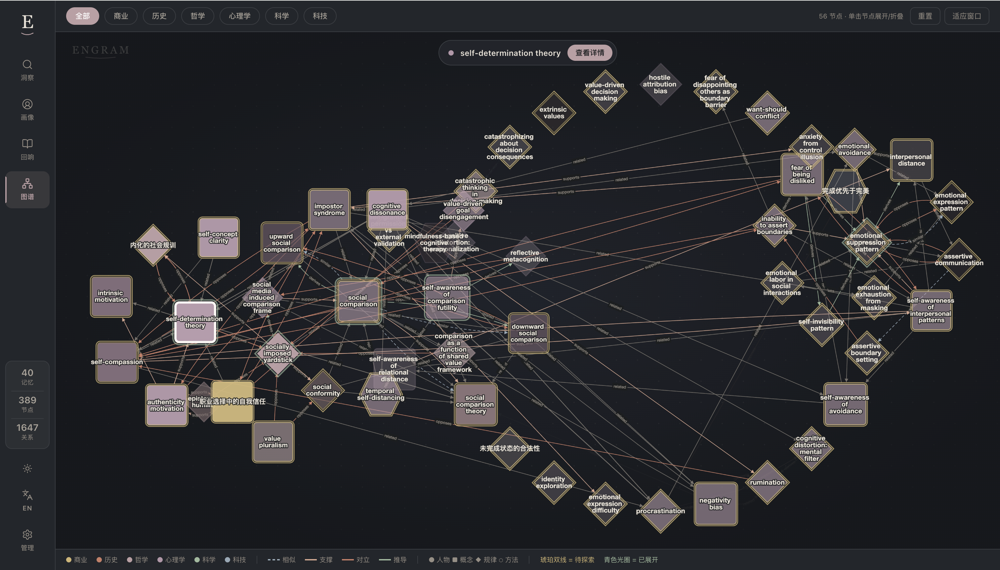
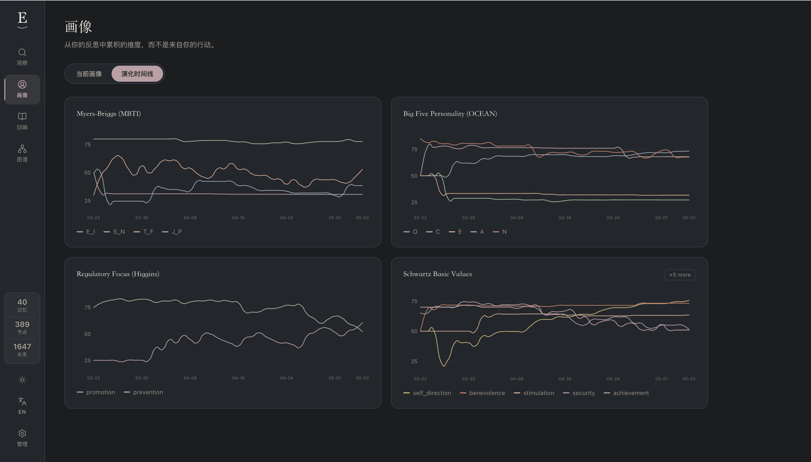

# Engram

[English](README.md) · **中文**

> **Engram —— AI 一直缺失的那部分「你」。**

大多数 AI 在回答「你的问题」。Engram 让 AI 回应「你这个人」。

它在背后悄悄建模你的思考方式——你的价值观、恐惧、反复出现的模式、你从内部看不见的那些自相矛盾。然后你接入的任何 AI（Claude、Cursor、Codex…）都不再是个聪明的陌生人，而更像一位认识你多年的成长教练。

不是笔记 app，不是记忆层。是一面**私人认知之镜**——照亮挡住你的盲区，唤出你自己都没意识到的突破。

---

## 它的回答会是什么样

同一个模型在底下推演 —— 两种角度：一面对内，一面对工作。

### 个人

> **你：** 总是答应了不想答应的事，然后心里又怨气。为什么？
>
> **Engram：** 这不是意志力的问题。你的认知图里有三股力同时在拉：
>
> - 寻求认同模式（**strength 0.86**，你图中第二强的节点）——别人话还没说完，你就已经把「不被认可」读成「危险」。
> - 高**亲和性（78）** + 低**自我主张（32）**——你的反射是「先把场面圆下来」，不是「先把界划清」。
> - Schwartz **顺从** 排在 **自主导向** 之上——你确实重视和谐，但代价是花掉的是你自己的时间。
>
> 解药其实早在你自己的记录里：三周前你写过「要挣得让别人失望的权利」。这句话本来就是你信任的动作。两个练习：所有非紧急的「行」先压 24 小时再回；每周给自己一个小小的「不」，重训那条回路。
>
> 当年的「答应」是有保护意义的——它在那种「不同意会被惩罚」的房间里救过你。但你现在不在那个房间里了。

### 工作

> **你：** 两个 offer 摆面前——稳定大厂高 title，早期 startup 小 title。来回摇摆一周了，到底缺了什么？
>
> **Engram：** 你不是在摇摆，是问题问错了。你的图里答案很清楚：
>
> - Schwartz **自主导向（88）** 排第 1，**安全感（61）** 排第 5——当你想象去大厂那一刻，你内心做选择的那部分是「沉默」的，不是「满意」的。
> - **开放性（78）** + **INTJ N-axis（72）**——你天然把不确定性当输入消化，不是当威胁。「风险」这个框架是从别人那借来的，不是你自己的。
> - 「选择权 > title」这个意象今年在你记录里出现了 4 次（strength 0.74，还在涨），结论你心里早就有了。
> - 但 **预防焦点（84）** 很大声。它会持续生成「万一失败怎么办」，直到你给它一个**具体兜底**，不是「会没事的」。
>
> 这道题不是「稳 vs 险」。是「我相信我自己看见的那条路吗，还是先准备 6 个月生活兜底，让预防焦点闭嘴之后再选」。把兜底建好，选择会在一个下午自动浮出来。
>
> 摇摆不是不果断，是预防焦点和自主导向在没有裁判的情况下吵架。给它们一份共享预算。

没有其他记忆工具能给出这种回答——因为它们没有一份关于「你」的模型可以推演。

---

## 这个模型到底长什么样



> *每个节点是一个概念、价值或反复出现的模式。边表达相似 / 支持 / 对立 / 派生。颜色按 domain（psychology / philosophy / business / …）。点任意节点可以展开它的邻域。*

这不是搜索索引，是一个模型。下面是 Engram 在回答你时所推演的结构化快照：

```
┌─────────────────────────────────────────────────────────┐
│  画像 —— 基于 40 条反思 · 389 个图谱节点                  │
├─────────────────────────────────────────────────────────┤
│  OCEAN                                                  │
│   开放性 Openness          ████████░░  78               │
│   尽责性 Conscientiousness █████████░  86               │
│   外倾性 Extraversion      ████░░░░░░  41               │
│   亲和性 Agreeableness     ███████░░░  72               │
│   神经质 Neuroticism       ████████░░  75               │
├─────────────────────────────────────────────────────────┤
│  MBTI · INTJ                                            │
│   I 64 / E 36     N 72 / S 28                           │
│   T 81 / F 19     J 67 / P 33                           │
├─────────────────────────────────────────────────────────┤
│  Schwartz 价值观（前 3）                                 │
│   自主导向 Self-direction   ●●●●●○                      │
│   成就    Achievement      ●●●●○○                       │
│   仁慈    Benevolence      ●●●○○○                       │
├─────────────────────────────────────────────────────────┤
│  反复出现的模式（图谱节点按强度）                          │
│   预期差防御机制         0.92  ▲ 上升                    │
│   认知重构              0.81  ↔ 稳定                    │
│   寻求认同              0.78  ▼ 下降                    │
└─────────────────────────────────────────────────────────┘
```

并且它在演化：



> *你可以看见自己正在变成另一个人。*

当你问 Engram「我为什么会这样」时，这个东西——图谱 + 画像 + 演化曲线——就是它推演的对象。不是「这是你写过的 12 条相关笔记」，而是一份对「你倾向于是怎样的人」的连贯读取，每个分数的来源都可以追溯。

---

## 把这面镜子做成你自己的

上面那些维度（OCEAN / MBTI / Schwartz / 6 个默认 backbones —— 心理 / 哲学 / 商业 / 科学 / 历史 / 技术）只是起点，不是终点。**Engram 的维度配置就是一个 YAML + prompt 模板的目录** —— 往里面扔一个新文件夹、重启，新维度立刻活了。

```
默认 backbones                       你自己加的 backbones
─────────────────                    ──────────────────────
psychology     ●●●●●○                创作能量曲线        (艺术家)
philosophy     ●●●●○○                决策一致性          (创业者)
business       ●●●○○○                共情成本            (父母)
science        ●●○○○○                注意力深度          (研究者)
history        ●●○○○○                ...
technology     ●●●○○○
```

每加一个维度，模型就多一面观察你的镜子。**你的镜子，由你定义坐标。** 具体配方见下面的 *Adding a dimension*。

---

> **Engram 不是笔记 app。** 别用它记「今天午饭吃了什么」。用它捕捉那些你正在思考、犹豫、决定、意识到的瞬间。纯事件流水会在意图门被礼貌挡回。

---

## Engram 与众不同

大多数 AI 记忆层是以检索为中心：存文本、搜文本。Engram 是建模层——它在建模「你」。

| 能力 | Engram | 典型的记忆层 |
|------|--------|-------------|
| 人格画像（OCEAN + MBTI + Schwartz 价值观） | ✅ | ❌ |
| 带时间衰减的知识图谱 | ✅ | ❌ |
| 单条 entry 的情境上下文分析 | ✅ | ❌ |
| 精确的 LIFO 撤销（图状态回滚） | ✅ | ❌ |
| 可扩展的维度系统（YAML 定义） | ✅ | ❌ |
| 按领域定制的 backbones | ✅ | ❌ |
| 兼容 MCP（Claude Code、Cursor 等） | ✅ | 部分 |

---

## 工作原理

```
你写下 / 说出 / 发送的一段思考
         ↓
   [ 捕获 ]              意图门：接受思考，拒绝纯事件流水
         ↓
   [ 切片管线 ]          抽取 OCEAN / MBTI / Schwartz / 情境上下文
         ↓
   [ 主干图 ]            构建知识节点 + 边，应用时间衰减
         ↓
   [ 画像融合 ]          沿时间累积人格维度
         ↓
   [ 查询 ]              基于完整认知图谱回答问题
```

每条 entry 都贡献信号。画像在演化，图谱在变密。数月后，Engram 拥有一份关于你的价值观、信念、模式与盲区的完整模型——并把它开放给你使用的任意 AI 工具。

---

## 快速开始

### 本地开发（不需要 Docker）

最适合代码迭代：后端 `.py` 改动自动重载，前端 Vite HMR。两个 terminal。

**前置依赖：** Python 3.12+、pnpm（Node 20+）、以及一个 LLM API key（任何 OpenAI 兼容的服务商均可——OpenAI / Anthropic / DeepSeek / Moonshot / 智谱 / Ollama 等）。

#### 一次性 setup

```bash
# API：建 venv、装依赖、复制 env 模板
cd api
python3.12 -m venv .venv
source .venv/bin/activate
pip install -r requirements.txt
cp .env.example .env

# Web：装 node_modules
cd ../web
pnpm install
```

然后编辑 `api/.env`，填入你的 LLM 凭据。两种方式：

- **方式 A（显式配置）：** 保留 `LLM_BASE_URL`，填 `LLM_API_KEY` 和 `LLM_MODEL`。默认指向 OpenAI。
- **方式 B（预设 provider）：** 注释掉方式 A，反注释方式 B，挑一个 provider：

  ```bash
  LLM_PROVIDER=anthropic            # 也可: openai | deepseek | moonshot | qwen | glm | gemini | ...
  LLM_API_KEY=sk-ant-...
  LLM_MODEL=claude-sonnet-4-5
  ```

#### 日常启动（两个 terminal）

**Terminal 1 — API，端口 `:18080`**

```bash
cd api
source .venv/bin/activate
PYTHONPATH=.. ENGRAM_DEV=1 uvicorn app.main:app \
  --reload --reload-dir . --reload-dir ../shared \
  --port 18080
```

看到 `Application startup complete.` 即就绪。

> **为什么要 `PYTHONPATH=..` 加 `--reload-dir ../shared`？** `shared/` 在仓库根目录（`api/` 的上一级）：`PYTHONPATH=..` 把它加进 Python 的 import path，`--reload-dir ../shared` 让 uvicorn 把 `shared/` 也纳入热重载监控（默认 `--reload` 只盯 CWD）。Docker 镜像里 Dockerfile 把 `shared/` 拷贝进去且不需要 reload，所以两个都不需要。

**Terminal 2 — Web，端口 `:5173`**

```bash
cd web
pnpm dev
```

看到 `Local: http://localhost:5173/` 即就绪。

#### 浏览器访问

http://localhost:5173

#### 验证整条链路

```bash
curl http://localhost:5173/health     # 通过 Vite proxy 转给 FastAPI
# → {"status":"ok"}
```

返回 `ok` 说明 proxy + API 都正常，可以开始写 entry。

#### 常见问题

| 现象 | 可能原因 / 修复 |
|---|---|
| `ModuleNotFoundError: No module named 'shared'` | 漏了 `PYTHONPATH=..`，或没在 `api/` 目录下执行。 |
| 浏览器里 `/ui/api/stats` 返回 404 | API 没起在 18080，或起来后崩了——看 Terminal 1。 |
| LLM 调用返回 401 / 403 | `api/.env` 的 key 没填或填错。 |
| 白屏 / dashboard 加载不出来 | Web dev server 没起，或 5173 端口被别的进程占用。 |
| Capture 被 "intent gate" 拒绝 | 设计如此——Engram 只接受反思类内容，不存事件流水。把句子写成"思考"，不要写成"事实"。 |
| 想清空本地状态从零开始 | `rm api/data/cognitive.db`，重启 API。 |

### 本地 Docker 冒烟测试（推送 VPS 前推荐）

```bash
cd deploy
docker compose up --build
# 浏览器打开 http://localhost
docker compose down  # 完事后停止
```

### VPS 部署（默认：Tailscale 私网模式）

前置条件：VPS 已安装并启用 Tailscale，本地设备加入同一 Tailnet，VPS 防火墙不开放公网 80 端口。

```bash
ssh <vps>
git clone <this-repo> ~/engram
cd ~/engram
cp api/.env.example api/.env  # 填入凭据
cd deploy
docker compose up -d --build
# 从任意 Tailscale 设备访问：http://<vps-tailscale-ip>
```

### VPS 部署（公网 HTTPS）

参考 `deploy/Caddyfile.https.example` 公网部署模板。**警告**：v1 没有内置认证，对外暴露前请在前面挂一层（如 basic-auth / OIDC 代理）。

---

## 接入到你的 AI 工具

MCP server 是一层薄薄的 stdio 桥接：AI 客户端按需把它 fork 为子进程，子进程再通过 HTTP 把工具调用转给跑在 `localhost:18080` 的 api service。构建一次，所有客户端都指向同一个 `dist/index.js`。

### 构建 MCP server

```bash
cd cognitive-mcp
pnpm install
pnpm build
# 产物：cognitive-mcp/dist/index.js
```

> 改了 MCP 源码后必须重新 `pnpm build`，并让客户端重连（或重启）以加载新产物。

### Claude Code

推荐用 CLI（避免手动改 JSON 写错路径）：

```bash
claude mcp add engram --scope user \
  --env ENGRAM_SERVICE_URL=http://127.0.0.1:18080 \
  -- node /绝对路径/engram/cognitive-mcp/dist/index.js
```

或者直接编辑 `~/.claude.json`，在顶层 `mcpServers` 下加：

```json
{
  "mcpServers": {
    "engram": {
      "command": "node",
      "args": ["/绝对路径/engram/cognitive-mcp/dist/index.js"],
      "env": { "ENGRAM_SERVICE_URL": "http://127.0.0.1:18080" }
    }
  }
}
```

验证：在 Claude Code 里输入 `/mcp`，`engram` 应显示 **connected**。

### Cursor

编辑 `~/.cursor/mcp.json`（项目级则放仓库根目录的 `.cursor/mcp.json`）：

```json
{
  "mcpServers": {
    "engram": {
      "command": "node",
      "args": ["/绝对路径/engram/cognitive-mcp/dist/index.js"],
      "env": { "ENGRAM_SERVICE_URL": "http://127.0.0.1:18080" }
    }
  }
}
```

验证：Cursor → Settings → MCP，`engram` 一行应该有绿点。

### Codex CLI

编辑 `~/.codex/config.toml`（注意是 TOML，不是 JSON）：

```toml
[mcp_servers.engram]
command = "node"
args = ["/绝对路径/engram/cognitive-mcp/dist/index.js"]

[mcp_servers.engram.env]
ENGRAM_SERVICE_URL = "http://127.0.0.1:18080"
```

验证：`codex mcp list` 应能看到 `engram`。

### 暴露的工具

以上任意一个客户端连通后，都会拿到这两个工具：
- **`cognitive_capture_thought`** — 捕获一段想法、反思、灵感或观察（事件/事实日志会在 intent gate 被拒）
- **`cognitive_query`** — 基于你的完整认知画像发起查询

### OpenClaw

```bash
cd cognitive-openclaw
# 按 OpenClaw 的配置方式作为插件加载
```

---

## 项目结构

```
engram/
  api/                   # 核心后端 — FastAPI、SQLite、HNSWLIB
    app/
      config/
        dimensions/      # 画像维度：OCEAN、Schwartz、facts
        entry_analyzers/ # 单条 entry 分析器：情境上下文
        backbones/       # 知识图谱域
      lib/               # 管线：slice / backbone / profile merge / query
      routes/            # HTTP API
    migrations/
  web/                   # 前端 SPA — React、Vite、Tailwind
  deploy/                # docker-compose + Caddyfile
  shared/                # 共享 LLM 客户端
  cognitive-mcp/         # MCP 服务器 — Claude Code、Cursor 等
  cognitive-openclaw/    # OpenClaw 插件
```

---

## 核心概念

**Dimension（画像维度）** — 沿时间累积的画像维度。OCEAN（大五人格）与 Schwartz 价值观是内置维度。在 `config/dimensions/` 下放一个目录就能加新维度。

**Entry analyzer（条目分析器）** — 仅对单条 entry 进行标注，不影响画像。情境上下文（时间视角、压力等级等）是内置分析器。它们帮管线对每条 entry 调整处理方式。

**Backbone graph（主干图）** — 从 entry 中抽取出的概念、信念、关系所构成的知识图谱。节点未被强化时会随时间衰减；边在多次共现中加强。

**LIFO Revert（按序撤销）** — 每条已处理 entry 都记录回滚快照。可按写入顺序撤销，将图谱与画像还原到任意历史状态——非常适合清理低质捕获或语音识别错误。

---

## 配置

### LLM — 一套通用接入层，任意模型

Engram 对接所有暴露 OpenAI 风格 `/chat/completions` 端点的 LLM。**只需配置三个变量**，流式 / 非流式都自动支持：

```env
LLM_BASE_URL=https://api.openai.com/v1
LLM_API_KEY=sk-...
LLM_MODEL=gpt-4.1-mini
```

就这样。没有 provider 开关，没有流式开关。

**也可以用预设**——只填 `LLM_PROVIDER` + `LLM_API_KEY`（想覆盖默认模型再加 `LLM_MODEL`）：

| 预设 | 提供商 | 备注 |
|------|--------|------|
| `openai`     | OpenAI                | GPT-4.1 / GPT-5 / o 系列 |
| `anthropic`  | Anthropic Claude      | 走 Anthropic 官方 OpenAI 兼容端点 |
| `gemini`     | Google Gemini         | 走 Gemini 官方 OpenAI 兼容端点 |
| `grok`       | xAI Grok              | |
| `openrouter` | OpenRouter            | 一把 key 用上百个模型 |
| `deepseek`   | DeepSeek              | |
| `moonshot`   | 月之暗面 Kimi          | |
| `qwen`       | 阿里 Qwen / DashScope | 走 OpenAI 兼容模式 |
| `glm`        | 智谱 GLM              | |
| `minimax`    | MiniMax               | |
| `ark`        | 火山引擎 ARK / 豆包    | |
| `ollama`     | 本地 Ollama           | `http://localhost:11434/v1` |

其他任意 OpenAI 兼容端点（vLLM、LM Studio、LiteLLM、Together、Groq、Fireworks…）也是同样的三件套：直接配置 `LLM_BASE_URL` / `LLM_API_KEY` / `LLM_MODEL` 即可。

#### 兼容性矩阵 — 诚实标注

Engram 走的是一套通用协议（OpenAI 兼容的 chat completions + tool calling），按规范绝大多数 provider 都该能直接跑。下表区分**已端到端实测**与**按协议应可跑通但暂未实际验证**。如果你跑出问题，欢迎开 issue 反馈。

| Provider | Chat | 工具调用 | JSON 管线 | 状态 |
|---|---|---|---|---|
| DeepSeek          | ✅ | ✅ | ✅ | **已验证** |
| ARK / 豆包         | ✅ | ✅ | ✅ | **已验证**（embedding 也走它） |
| OpenAI            | ✅ | ✅ | ✅ | 协议兼容 — 暂未实测 |
| Anthropic Claude  | ✅ | ✅ | ✅ 走 prompt 兜底 | 协议兼容 — 暂未实测 |
| Google Gemini     | ✅ | ✅ | ✅ | 协议兼容 — 暂未实测 |
| xAI Grok          | ✅ | ✅ | ✅ | 协议兼容 — 暂未实测 |
| Moonshot Kimi     | ✅ | ✅ | ✅ | 协议兼容 — 暂未实测 |
| 阿里 Qwen         | ✅ | ✅ | ✅ | 协议兼容 — 暂未实测 |
| 智谱 GLM          | ✅ | ✅ | ✅ | 协议兼容 — 暂未实测 |
| MiniMax           | ✅ | ✅ | ✅ | 协议兼容 — 暂未实测 |
| OpenRouter        | ✅ | 取决于路由的模型 | 取决于路由 | 协议兼容 — 暂未实测 |
| Ollama（本地）     | ✅ | 看模型（llama3.1+ / qwen2.5+ / gpt-oss） | ✅ | 协议兼容 — 暂未实测 |

> **Embedding 提示**：Anthropic、DeepSeek、Moonshot 自己不提供 embedding 服务，需要搭配一个有 embedding 的 provider（OpenAI / GLM / Qwen / ARK / Ollama / Voyage / Jina），通过 `EMBED_BASE_URL` + `EMBED_API_KEY` + `EMBED_MODEL` 单独配置。

### Embedding

Embedding 同样走 OpenAI 兼容的 `/embeddings`，**自动回退到 `LLM_*`**——常见情况下只需要配置模型名：

```env
EMBED_MODEL=text-embedding-3-small
# EMBED_BASE_URL / EMBED_API_KEY — 仅当 embedding 走和 chat 不一样的 provider 时才需要
```

### 添加维度

在 `api/app/config/dimensions/my_dim/` 创建：

```
my_dim/
  config.py      # DIMENSION = { "key": "my_dim", ... }
  extract.spt    # 抽取 prompt 模板
  rubric.md      # 评分标准（可选）
```

下次启动时会被自动发现，无需改代码。

---

## 协议

**AGPL-3.0-or-later。** 完整文本见 [`LICENSE`](LICENSE)。

简而言之：个人 / 自部署使用永久免费，没有任何附加义务。如果你**把修改后的版本作为网络服务对外提供**，必须让用户能拿到对应的修改源码（AGPL §13）。把它与闭源产品合并需要商业授权，详见 [`LICENSING.md`](LICENSING.md)。
